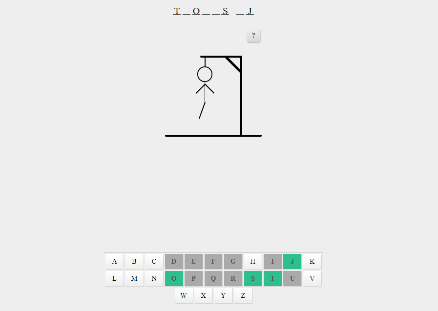

# Hangman Game: Uncover the Mystery Word and Save the Stickman!

Welcome to the thrilling world of Hangman, where your word-guessing skills will be put to the ultimate test. Hangman is a classic game that challenges you to unravel a hidden word letter by letter, all while trying to save a stickman from a disastrous fate. With its immersive design, intuitive gameplay, and exciting features, Hangman promises hours of suspense and entertainment.
## Features

- **Immersive Visuals:** The captivating HTML layout and stylish CSS design create an engaging and visually appealing game environment. From the home screen to the result screen, every element is meticulously designed to enhance your gaming experience.

- **Diverse Word Selection:** The game offers a wide range of words to uncover, ensuring each playthrough is unique and filled with surprises. With words ranging from everyday objects to pop culture references, there's always a new challenge waiting for you.

- **Responsive and Touch-friendly:** The game is designed to be responsive and touch-friendly, allowing you to enjoy the Hangman experience seamlessly across different devices and screens. Whether you're using a desktop, laptop, tablet, or smartphone, Hangman adapts to provide an optimal gaming experience.

- **Progressive Difficulty:** As you make incorrect guesses, the elements representing the stickman's body gradually appear, creating a sense of urgency and challenge. Can you guess the word before the stickman meets his unfortunate fate?

- **Hint System:** When you find yourself stuck, the game offers a hint system to provide a clue related to the hidden word. Use it wisely to uncover those hard-to-guess letters and gain an edge in your quest to save the stickman.

## How to play

- Launch the Hangman game and click the "Play" button on the home screen to begin a new game.

- A hidden word will be randomly selected from a diverse collection. Your task is to guess the word by selecting letters from the virtual keyboard displayed on the screen.

- Click on the letters to make your guesses. If the chosen letter is part of the word, it will be revealed in its correct position. If not, the elements representing the stickman's body will start to appear.

- Continue guessing letters until you either uncover the entire word or the stickman's body is completely revealed. The outcome of the game will be displayed on the result screen, either celebrating your victory or mourning your defeat.

- If you want to play again, simply click the "Try Again?" button on the result screen to start a new game and challenge yourself with a different word.
## Code Structure

The Hangman game code is structured to ensure smooth gameplay and easy maintenance. Here's a breakdown of its components:

- *Word Selection:* An array contains a collection of words, each paired with a hint. This ensures a diverse and exciting gameplay experience, with a vast range of words to uncover.

- *HTML Layout:* The HTML file provides the foundation for the game's visual presentation. It includes various div elements to structure the game screens, such as the home screen, result screen, player model, hints, and the virtual keyboard.

- *CSS Styling:* The CSS file defines the styles and visual effects applied to the HTML elements. It enhances the game's aesthetic appeal, creating an immersive atmosphere.

- *JavaScript Logic:* The JavaScript code powers the game mechanics and interactivity. It handles the initialization of the game, tracks player progress, validates guesses, reveals correct letters, manages hints, and determines the game's outcome.

- *Event Listeners:* The code attaches event listeners to elements like buttons and touch gestures, enabling seamless interaction and responsive gameplay.

- *Helper Functions:* Several helper functions are implemented to assist with tasks such as word selection, creating the virtual keyboard, clearing game data, revealing correct letters, displaying hints, and handling game results.

Join the Hangman adventure and put your word-guessing skills to the test. Uncover the mystery word, save the stickman, and embrace the thrill of this timeless classic!
